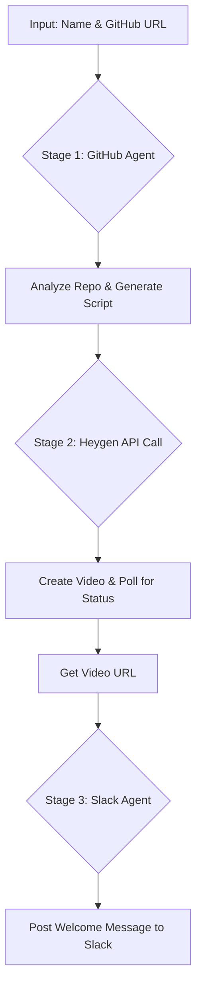

# GitHub Onboarding Video Agent ✨

This project is an AI-powered agent that automates a key part of the new team member onboarding process. It takes a team member's name and a GitHub repository URL, analyzes the repository, generates a custom AI video tutorial, and posts a welcome message to Slack.

<!-- Optional: Create a short GIF of the agent running and add it here -->
<!--  -->

---

## 🚀 What It Does

The agent orchestrates a three-stage workflow to provide a seamless and engaging onboarding experience:

1.  **🤖 AI-Powered GitHub Analysis**: The agent uses an AI model to analyze the provided GitHub repository, understanding its purpose, structure, and recent activity from the README and key files.
2.  **✍️ Automatic Script Generation**: Based on its analysis, the agent writes a concise, conversational 30-second video script to introduce a new member to the repository.
3.  **🎬 AI Video Creation**: Using the generated script, the agent calls the **Heygen API** to create a high-quality video featuring a realistic AI avatar.
4.  **📢 Slack Notification**: Once the video is ready, the agent posts a welcome message in a designated Slack channel, tagging the new member and including a link to the generated video.

## 📋 Features

-   **Interactive CLI**: Simple command-line interface to input the new member's name and repository URL.
-   **Multi-Agent Architecture**: Breaks down the complex task into isolated, reliable stages for analysis, video creation, and notification.
-   **Secure API Management**: Leverages **Composio** to securely manage connections and authentication for GitHub, Heygen, and Slack.
-   **Direct API Control**: Uses Composio's `proxyExecute` for precise, reliable control over the complex Heygen video generation payload.
-   **Robust Polling**: Includes a polling mechanism to patiently wait for the asynchronous video generation to complete.
-   **Extensible**: Built with TypeScript and a modular structure, making it easy to add new tools or steps to the workflow.

## 🛠️ Workflow Diagram



## ⚙️ Setup and Installation

Follow these steps to get the agent up and running on your local machine.

### 1. Prerequisites

-   [Node.js](https://nodejs.org/) (v18 or higher)
-   [npm](https://www.npmjs.com/) (usually comes with Node.js)
-   [Git](https://git-scm.com/)
-   Accounts for:
    -   [Composio](https://composio.dev/)
    -   [OpenAI](https://platform.openai.com/)
    -   [GitHub](https://github.com/)
    -   [Heygen](https://www.heygen.com/)
    -   [Slack](https://slack.com/) (with permissions to post in a channel)

### 2. Clone the Repository

```bash
git clone https://github.com/sailorworks/onboarding-agent.git
cd onboarding-agent
```

### 3. Install Dependencies

```bash
npm install
```

### 4. Connect Your Accounts with Composio

This project uses Composio to securely manage API connections. You'll need to create "Auth Configs" in your [Composio Dashboard](https://platform.composio.dev/) for GitHub, Heygen, and Slack. Composio will provide a unique `ac_...` ID for each service.

### 5. Configure Environment Variables

Create a `.env` file in the root of the project by copying the example file:

```bash
cp .env.example .env
```

Now, open the `.env` file and fill in the required values:

| Variable                  | Description                                                                 |
| ------------------------- | --------------------------------------------------------------------------- |
| `COMPOSIO_API_KEY`        | Your API key from the Composio dashboard.                                   |
| `OPENAI_API_KEY`          | Your API key from the OpenAI platform.                                      |
| `GITHUB_AUTH_CONFIG_ID`   | The `ac_...` ID for your GitHub connection from the Composio dashboard.     |
| `HEYGEN_AUTH_CONFIG_ID`   | The `ac_...` ID for your Heygen connection from the Composio dashboard.       |
| `HEYGEN_API_KEY`          | Your API key from the Heygen platform (for direct proxy calls).             |
| `SLACK_AUTH_CONFIG_ID`    | The `ac_...` ID for your Slack connection from the Composio dashboard.        |
| `SLACK_CHANNEL_ID`        | The ID of the Slack channel where notifications will be posted (e.g., `C0123ABC`). |

## ▶️ Usage

Once the setup is complete, you can run the agent.

### 1. Build the Project

This compiles the TypeScript code into JavaScript.

```bash
npm run build
```

### 2. Start the Agent

This command starts the interactive CLI.

```bash
npm run start
```

The agent will then prompt you for the new team member's name and the GitHub repository URL to begin the onboarding process.

## 📂 Project Structure

Here is a brief overview of the key files in this project:

```
.
├── src/
│   ├── OnboardingAgent.ts  # Core logic orchestrating the 3-stage workflow.
│   ├── composio.ts         # Utilities for creating Composio sessions and connections.
│   └── connection.ts       # Loads and validates environment variables.
├── index.ts                # Main entry point and interactive CLI setup.
├── package.json            # Project dependencies and scripts.
└── tsconfig.json           # TypeScript compiler configuration.
```

## 🤝 Contributing

Contributions are welcome! Please feel free to submit a pull request or open an issue.

## 📜 License

This project is licensed under the MIT License. See the [LICENSE](LICENSE) file for details.
